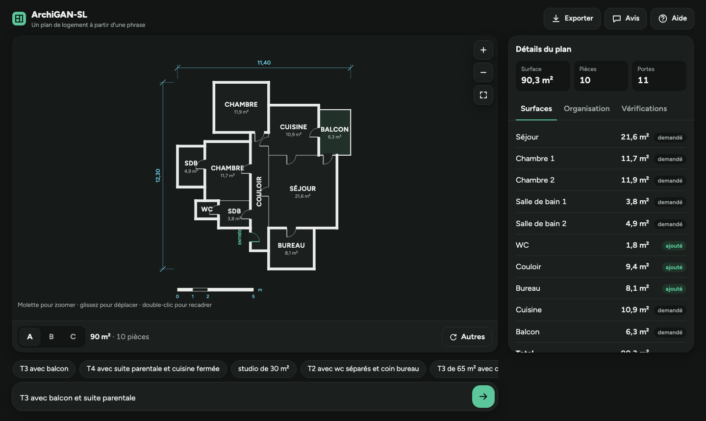

# ArchiGAN-SL

Génération de plans de logements 2D à partir d'une requête en français, par un GAN conditionnel entraîné en Split Learning.

> « T4 avec suite parentale et cuisine fermée » → programme des pièces → graphe de distribution → plan

**Démonstration en ligne : https://archigansite.vercel.app**  
**Article (PDF) : [ArchiGAN-SL_article.pdf](article/ArchiGAN-SL_article.pdf)**

Projet de recherche de **Kenny Tshibangu Ntumba**, Université Nouveaux Horizons (Lubumbashi), dans le prolongement du mémoire de Master (2025). Version bêta.



## Principe

1. **Parser.** La requête est convertie en contraintes partielles. Il reconnaît les typologies (studio, T1 à T6), les pièces et leurs synonymes, les nombres, les négations (« sans balcon »), une surface (« de 65 m² ») et des structures (« suite parentale », « cuisine fermée », « WC séparés », « coin bureau »…).
2. **cGAN.** Un générateur conditionnel complète ce que la requête ne précise pas : le nombre de pièces de chaque type et la topologie du graphe de bulles (6 variables de rattachement).
3. **Snap.** Les valeurs imposées par la requête sont rétablies telles quelles.
4. **Placement v3.** Un algorithme place les pièces en suivant le graphe de bulles, puis pose les portes en arbre (une porte par pièce privée, aucune liaison interdite) et une porte d'entrée. La surface demandée est respectée.
5. **Split Learning.** Le cGAN peut être entraîné entre plusieurs agences et un serveur sans que leurs données ne quittent leurs locaux (variantes SL et SplitFed, avec ou sans bruit sur les activations échangées).

## Contenu du dépôt

| Dossier | Contenu |
|---|---|
| `notebooks/ArchiGAN_SL_v2.ipynb` | Notebook complet : données, entraînement, évaluation, ablations, Split Learning, attaque par inversion, export des résultats |
| `notebooks/ArchiGAN_Prompter_cGAN_original.ipynb` | Notebook d'origine (première version du prompter cGAN), conservé pour référence |
| `archigan_site/` | Démonstration web publiée sur Vercel (`index.html`, un seul fichier, sans serveur) |
| `docs/` | Copie de la démonstration, tenue à jour par l'assemblage |
| `web/` | Sources de la démonstration : moteur JavaScript (portage du notebook), gabarit de page, scripts d'export et d'assemblage, captures d'écran |
| `models/cgan_final.pt` | Poids du générateur entraîné (PyTorch) |
| `resultats/` | Résultats chiffrés de l'entraînement complet (`resultats.json`) et figures |
| `article/` | Article (sources LaTeX, gabarit ICCK) et PDF compilé : [`ArchiGAN-SL_article.pdf`](article/ArchiGAN-SL_article.pdf) |

## Utilisation

### Notebook (Google Colab)

Ouvrez `notebooks/ArchiGAN_SL_v2.ipynb` dans Colab avec un GPU, puis « Exécuter tout » (environ 1 h 15 avec toutes les expériences). Les expériences longues se désactivent dans la cellule 0 (`RUN_ABLATION`, `RUN_SPLIT`, `RUN_NOISE`) et `QUICK = True` lance un test complet en quelques minutes. La cellule 15 exporte les résultats, les figures et un fichier de macros LaTeX.

Pour générer des plans une fois le modèle entraîné :

```python
plan("T3 avec balcon et suite parentale", n=3)
```

### Démonstration web

**https://archigansite.vercel.app** : tout s'exécute dans le navigateur, sans serveur ni installation. L'interface est conçue d'abord pour le téléphone, puis adaptée à la tablette et à l'ordinateur :

| Élément | Rôle |
|---|---|
| Plan, au centre | Plan coté en grand ; zoom à deux doigts, à la molette ou avec les boutons, déplacement au doigt ou à la souris, double-tap ou double-clic pour recadrer |
| Saisie, en bas | Champ fixé en bas de l'écran (comme une messagerie), avec des exemples à toucher juste au-dessus |
| Barre sous le plan | Variantes **A, B, C**, surface et nombre de pièces, bouton **Autres** pour de nouvelles propositions |
| Détails | Onglets **Surfaces**, **Organisation** (schéma de distribution) et **Vérifications** : volet qui glisse depuis le bas sur téléphone et tablette, panneau latéral sur ordinateur |
| En haut | **Exporter** (plan en SVG, fond blanc, prêt à imprimer), **Avis** (remarque envoyée à l'auteur par e-mail), **Aide** (mode d'emploi, affiché aussi à la première visite) |

La page suit le thème clair ou sombre de l'appareil.

Pour reconstruire la page après une modification des sources (`web/page_template.html`, `web/archigan.js`) ou un nouvel entraînement :

```bash
python web/export_model.py models/cgan_final.pt web/model.json web/fwd_test.json   # nouveau modèle seulement
node web/check_forward.js web/model.json web/fwd_test.json                         # nouveau modèle seulement
WEB3FORMS_KEY=... python web/build_page.py
```

`check_forward.js` vérifie que la passe avant JavaScript reproduit celle de PyTorch (écart maximal mesuré : 2 × 10⁻⁵). `build_page.py` écrit `archigan_site/index.html` et `docs/index.html`, ainsi que `web/archigan-sl.html`, une variante pour claude.ai où l'export passe par la plateforme et où les observations renvoient vers le site public.

La section « Observations » envoie les retours par e-mail via [Web3Forms](https://web3forms.com) ; la clé publique du formulaire est injectée par `WEB3FORMS_KEY`. Sans clé, le formulaire reste visible mais désactivé.

### Mettre à jour le site

Le site Vercel est publié depuis `archigan_site/` et se redéploie automatiquement, en une dizaine de secondes, à chaque envoi sur `main`. Depuis ce dossier :

```bash
git pull                     # récupérer les derniers changements
# ... modifier, puis éventuellement reconstruire la page (commande ci-dessus)
git add -A
git commit -m "Description de la modification"
git push
```

Pour vérifier qu'une mise à jour est en ligne, cherchez `version` dans le code source de la page (Cmd + U) : la date correspond à la dernière reconstruction.

## Résultats principaux

Entraînement complet sur 20 000 programmes (GPU Tesla T4), évaluation sur 22 requêtes × 50 variantes :

| Mesure | Valeur |
|---|---|
| Respect de la requête dans le plan final | 100 % |
| Structures demandées réalisées (graphe prédit par le cGAN / règles fixes) | 99,4 % / 50,8 % |
| Portes interdites | 0 |
| Pièces accessibles sans traverser une pièce privée | 100 % |
| Temps médian par plan (hors rendu) | 2,1 ms |
| Respect des contraintes : centralisé / SplitFed / une agence seule | 100 % / 97,9 % / 97,0 % |
| Programmes reconstruits par une attaque par inversion : sans défense / avec bruit | 52,9 % / 0,4 % |

Le détail figure dans `resultats/resultats.json`.


## Article

L'article qui présente ce travail est dans `article/`, avec le PDF compilé : [lire l'article](article/ArchiGAN-SL_article.pdf). Il se compile avec pdfLaTeX, directement sur Overleaf ou en local (`pdflatex`, `bibtex`, puis deux fois `pdflatex`). Tous les chiffres viennent de `article/resultats_macros.tex`, produit par la cellule 15 du notebook. Les logos du gabarit sont provisoires (cadres gris).

*Version de travail, non encore soumise.*

## Limites

Les programmes d'entraînement sont synthétiques : le modèle apprend une distribution définie par nos règles et non des plans réels. Les plans produits sont des esquisses de principe, pas des plans d'exécution. Le Split Learning est simulé dans un seul processus. Le nom « ArchiGAN » reprend celui des travaux de S. Chaillou (2019) sur la génération de plans par GAN, dont ce projet est indépendant.
